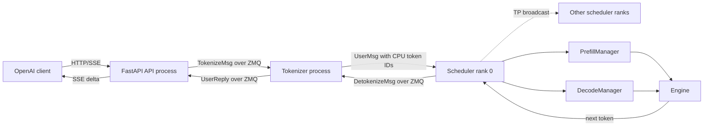

# Mini-SGLang Engine Architecture Map

## Scope And Baseline

This map describes official Mini-SGLang at pinned commit
`144024ee9cb96adf5fb6efba8898e6a61b42ad9f`, plus the explicitly documented
Engine Lab policy boundary. It is a source-level trace, not a claim that the
upstream engine was authored in this lab.

The lab uses one process per tensor-parallel rank. A single-GPU run has one
scheduler process and one Engine. The API server, tokenizer/detokenizer, and
scheduler communicate through ZMQ. Model tensors and KV state remain inside the
scheduler/Engine process.

## Cluster Router Versus Engine Scheduler

| Layer | Responsibility | Location |
| --- | --- | --- |
| Cluster router | Select one Worker among multiple model replicas | LLM-ServeLab FastAPI Gateway |
| Engine scheduler | Select prefill/decode work inside one Worker for the next GPU step | `python/minisgl/scheduler/scheduler.py` |

LLM-ServeLab's `least-active`, prefix-affinity, KV-aware, and
predicted-latency policies are cluster routing policies. They do not construct
GPU batches. Mini-SGLang's scheduler owns the token budget, running/waiting
state, KV admission, prefill chunks, decode batch, and actual model step.

## Process And Message Topology

Process creation begins in `python/minisgl/server/launch.py:launch_server`.
`multiprocessing` uses `spawn`. The API process owns Uvicorn; scheduler and
tokenizer workers are non-daemon child processes. ZMQ messages are serialized
by `python/minisgl/message/utils.py`.

## Request Lifecycle

### 1. API Entry

- Path: `python/minisgl/server/api_server.py`
- Functions: `v1_completions`, `FrontendManager.new_user`,
  `FrontendManager.send_one`
- Input: OpenAI-compatible chat request.
- Output: `TokenizeMsg(uid, text, SamplingParams)` to the tokenizer ZMQ queue.
- State change: allocates `ack_map[uid]` and `event_map[uid]`.
- Boundary: asyncio/FastAPI process to synchronous tokenizer process over ZMQ.

The pinned API always returns a `StreamingResponse`; its `stream` request field
does not select a non-stream response.

### 2. Tokenization

- Paths: `python/minisgl/tokenizer/server.py`,
  `python/minisgl/tokenizer/tokenize.py`
- Functions: `tokenize_worker`, `TokenizeManager.tokenize`
- Input: text or chat-template messages.
- Output: `UserMsg` containing a CPU `int32` token tensor.
- State change: none in the Engine; tokenizer batches only local pending ZMQ
  messages.
- Boundary: tokenizer process sends serialized tensor bytes to scheduler rank
  0 over ZMQ.

### 3. Request Admission

- Path: `python/minisgl/scheduler/scheduler.py`
- Function: `Scheduler._process_one_msg`
- Input: `UserMsg`.
- Output: a `PendingReq` appended to `PrefillManager.pending_list`.
- State change: clamps `max_tokens` to model sequence capacity.
- Boundary: scheduler CPU path.

`PendingReq` is created in `python/minisgl/scheduler/prefill.py:add_one_req`.
Engine Lab records its monotonic enqueue timestamp for waiting-time telemetry.

### 4. Policy Decision

- Paths: `python/minisgl/scheduler/scheduler.py`,
  `python/minisgl/scheduler/policy.py`
- Functions: `Scheduler._schedule_next_batch`,
  `BaseSchedulingPolicy.select`, `UpstreamDefaultPolicy.select`
- Input: immutable snapshots of waiting/running requests, prefill token budget,
  available KV pages, previous batch phase, and monotonic timestamp.
- Output: selected prefill/decode requests, chunk sizes, preemption IDs, reason
  codes, and decision latency.
- State change: the selected manager performs the same mutations as upstream.
- Boundary: pure policy decision followed by scheduler manager mutation.

`upstream_default` exactly preserves the pinned ordering:

1. call `PrefillManager.schedule_next_batch(max_extend_tokens)`;
2. only when no prefill batch is available, call
   `DecodeManager.schedule_next_batch()`.

No deadline-aware policy is implemented in Prompt 6A.

### 5. Waiting Queue And Prefill Admission

- Path: `python/minisgl/scheduler/prefill.py`
- Classes: `PrefillManager`, `PrefillAdder`, `PendingReq`, `ChunkedReq`
- Input: FIFO `pending_list`, token budget, decode reservation, cache/table
  capacity.
- Output: a `Batch(phase="prefill")`.
- State change: locks matched radix nodes, allocates a request table row,
  reserves remaining input/output capacity, and removes selected requests from
  the waiting list.
- Boundary: scheduler CPU plus asynchronous CPU-to-GPU copies.

The waiting list is FIFO and stops at the first request that cannot be admitted.
Long prompts are represented by `ChunkedReq`; the incomplete request is put
back before later pending requests. Chunk size is bounded by
`max_extend_tokens`.

### 6. Running Set And Decode Batch

- Path: `python/minisgl/scheduler/decode.py`
- Class: `DecodeManager`
- Input: requests that completed a non-final prefill/decode step.
- Output: `Batch(phase="decode")` containing all runnable requests.
- State change: adds/removes requests from `running_reqs`.
- Boundary: scheduler CPU.

At the pinned commit `running_reqs` is a Python set, so decode order is not a
stable FIFO contract. Official upstream later addressed decode-order
stability; Prompt 6A records but does not import that larger change.

### 7. Token And KV Budget

- Prefill token budget: `Scheduler.prefill_budget`, sourced from
  `SchedulerConfig.max_extend_tokens`.
- Admission reservation: `PrefillAdder.reserved_size`, initialized from
  `DecodeManager.inflight_tokens`.
- Available KV pages: `CacheManager.available_size`, free pages plus evictable
  radix pages.
- Maximum running requests: `TableManager._free_slots`.

There is no separate decode-token budget in the pinned policy. A decode step
uses every request in `running_reqs`.

### 8. Prefix Lookup And KV Admission

- Paths: `python/minisgl/scheduler/cache.py`,
  `python/minisgl/kvcache/radix_manager.py`
- Functions: `CacheManager.match_req`, `RadixCacheManager.match_prefix`,
  `PrefillAdder._try_allocate_one`
- Input: all prompt IDs except the final token.
- Output: cache handle and matched page indices.
- State change: matching is read-only; admission locks the matching radix path
  before page use.
- Boundary: CPU radix metadata plus GPU page-index tensors.

`cache_type=naive` always reports a zero-length hit. `cache_type=radix` tracks
LRU-like node timestamps and protected/evictable page counts.

### 9. Page Allocation And Page Table

- Paths: `python/minisgl/scheduler/cache.py`,
  `python/minisgl/scheduler/table.py`
- Functions: `CacheManager.allocate`, `TableManager.allocate`
- Input: sum of request `extend_len` values.
- Output: physical page indices and a request table row.
- State change: consumes `_free_slots`; may evict unlocked radix leaves.
- Boundary: scheduler metadata to GPU page table.

The pinned implementation uses page size 1. `Scheduler._prepare_batch` writes
allocated page indices into `Engine.page_table` before attention metadata is
planned.

### 10. Batch Preparation

- Path: `python/minisgl/scheduler/scheduler.py`
- Function: `Scheduler._prepare_batch`
- Input: selected `Batch`.
- Output: `ForwardInput(batch, sampling args, load indices, write indices)`.
- State change: allocates pages, pads decode batches to a captured CUDA Graph
  size, constructs token-pool mappings, and prepares attention metadata.
- Boundary: pinned CPU memory to GPU metadata stream.

### 11. Attention Backend

- Paths: `python/minisgl/attention/__init__.py`,
  `python/minisgl/attention/fi.py`,
  `python/minisgl/attention/fa3.py`
- Functions: `create_attention_backend`, backend `prepare_metadata` and
  `forward`.
- Input: request lengths, page table, Q/K/V tensors.
- Output: attention activations.
- State change: stores K/V into physical pages and plans backend metadata.
- Boundary: Python/CUDA runtime to FlashInfer or `sgl_kernel`.

The A6000 baseline resolves `auto` to FlashInfer. Engine Lab backports official
upstream fix `20fcd7f`, which serializes reuse of FlashInfer's pinned planning
buffer with a CUDA event. Without it, long-prefill traffic produced a real
illegal-memory-access failure.

### 12. Model Step And Sampling

- Paths: `python/minisgl/engine/engine.py`,
  `python/minisgl/engine/sample.py`
- Functions: `Engine.forward_batch`, `Sampler.prepare`, `Sampler.sample`
- Input: prepared batch and sampling arguments.
- Output: GPU and asynchronously copied CPU next-token tensors plus completion
  event.
- State change: `Req.complete_one()` advances cached/device length.
- Boundary: scheduler stream to Engine stream, then asynchronous D2H token copy.

Temperature zero uses `argmax`. Positive temperature uses in-place scaling,
softmax, and multinomial sampling.

### 13. CUDA Graph Capture And Replay

- Path: `python/minisgl/engine/graph.py`
- Class: `GraphRunner`
- Input: decode batch and configured graph sizes.
- Output: replayed logits or eager model output.
- State change: captures decode-only graphs at startup and pads decode batches
  to the next available captured size.
- Boundary: CUDA runtime graph capture/replay.

Prefill runs eagerly. Decode uses CUDA Graph only when the padded batch size is
within `max_graph_bs`.

### 14. Overlap Scheduling

- Path: `python/minisgl/scheduler/scheduler.py`
- Function: `Scheduler.overlap_loop`
- Input: previous in-flight `ForwardData`, new messages, manager state.
- Output: next in-flight `ForwardData`.
- State change: schedules next work on the scheduler stream while the prior
  Engine stream is executing, then processes the prior result.
- Boundary: two CUDA streams in one scheduler process.

`MINISGL_DISABLE_OVERLAP_SCHEDULING=1` selects `normal_loop`. The FlashInfer
planning race found in Prompt 6A occurred on this overlap boundary.

### 15. Completion And Streaming

- Paths: `python/minisgl/scheduler/scheduler.py`,
  `python/minisgl/tokenizer/detokenize.py`,
  `python/minisgl/server/api_server.py`
- Functions: `Scheduler._process_last_data`,
  `DetokenizeManager.detokenize`,
  `FrontendManager.stream_chat_completions`
- Input: CPU next token and completion event.
- Output: `DetokenizeMsg`, incremental text, and SSE chunks.
- State change: appends host token, removes finished request from decode,
  releases resources, and deletes frontend state after final acknowledgement.
- Boundary: scheduler to tokenizer to asyncio API process.

### 16. KV Release And Prefix Insertion

- Paths: `python/minisgl/scheduler/scheduler.py`,
  `python/minisgl/scheduler/cache.py`
- Functions: `Scheduler._process_last_data`,
  `CacheManager.free_and_cache_finished_req`
- Input: finished request's token IDs and page-table slice.
- Output: pages retained in radix cache or returned to free slots.
- State change: inserts the finished prefix, frees duplicate/unshared pages,
  unlocks the original cache handle, and frees the request table row.
- Boundary: scheduler CPU metadata and GPU page-index tensors.

### 17. Cancellation

- Paths: `python/minisgl/message/tokenizer.py`,
  `python/minisgl/server/api_server.py`
- Existing pieces: `AbortMsg` type and `FrontendManager.abort_user`.
- Pinned behavior: frontend abort only deletes acknowledgement/event state.
  `AbortMsg` is not exported through `message.__init__`, converted to a backend
  message, or handled by `Scheduler._process_one_msg`.

Therefore true scheduler cancellation and KV cleanup are not implemented at
the pinned baseline. This is an explicit Prompt 6B gate failure.

### 18. Exception Cleanup And Shutdown

- Paths: `python/minisgl/core.py`,
  `python/minisgl/server/launch.py`,
  `python/minisgl/scheduler/scheduler.py`
- Functions: `Context.forward_batch`, `_run_scheduler`, `Scheduler.shutdown`
- Guaranteed cleanup: `Context.forward_batch` resets global batch state in a
  `finally` block; `KeyboardInterrupt` invokes scheduler shutdown.
- Missing containment: a non-`KeyboardInterrupt` scheduler exception is not
  propagated to the API process. Prompt 6A observed the API remain healthy
  after the scheduler child crashed.

This false-readiness state is another Prompt 6B gate failure.

### 19. Metrics

Pinned upstream has logging but no scheduler-decision metric interface. Engine
Lab's `SchedulingMetrics` records:

- policy and decision count/latency;
- prefill/decode/idle decisions;
- batch request count and prefill/decode tokens;
- waiting/running peaks;
- maximum waiting time and unique starvation count.

An optional `--scheduler-metrics-path` writes an atomic JSON summary on clean
scheduler shutdown. Per-request prompts and token IDs are not recorded.

## Safe Policy Extension Point

New policies should implement `BaseSchedulingPolicy.select` and return a
`SchedulingDecision`. They must not:

- execute model work;
- allocate KV pages directly;
- mutate request token tensors;
- bypass manager invariants;
- hard-code policy logic into `overlap_loop`.

Before adding deadline behavior, the lab must first add real cancellation,
worker-failure readiness propagation, and deterministic decode ordering, then
repeat token-ID and workload baselines.
